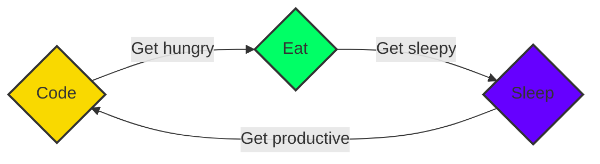

## :bar_chart: Github Stats:

**👋 Hi there!** 

I'm a creative Full Stack developer with three years of experience and an eye for aesthetics.

**💡 Passionate** 

About designing web and mobile applications, I love turning ideas into digital realities.

**🎨 My Inclination** 

Towards design reflects in my work, where I pride myself on creating both beautiful and functional user interfaces.

**🖥️ Proficient** 

In developing Single Page Applications with React.js and I master JavaScript and databases.

**Project Management 🚀**

Passionate about steering projects, I excel in transforming ideas into concrete achievements. With my mastery of both agile and traditional methodologies, I ensure stakeholder alignment, resource management, and achievement of objectives within the set timeframe and budget.

**🧰 Development Tools** 

With a suite of tools like GitHub, Express.js, Node.js, React.js, React Native, Figma, MongoDB, Next.js and Git at my disposal, I am ready to take on any challenge.

**<em>If you are looking for a developer who combines technical skills, a sense of design and an entrepreneurial spirit, don't hesitate to get in touch</em>**

## :handshake: Connect with me :

Let's stay connected and get in touch:

Feel free to reach out to me through these platforms. I look forward to connecting with you!

## :wrench: Languages & Tools :

Here are some of the languages and tools I work with:
  

   
   
   
  
   
   

  I am constantly expanding my knowledge and exploring new technologies to enhance my skills. Feel free to ask me about any specific language or tool mentioned above.

## :computer: My Coding Routine :

As a Developer, my daily life operates in a cycle that blends productivity and continuous learning seamlessly. Here's what it looks like:

1. **Coding:** Programming isn't just what I do—it's a passion that drives me. Be it tackling a complex problem or exploring a new technology, coding always presents an exciting challenge that brings immense satisfaction.

2. **Eating:** Proper nutrition is vital for a sharp mind. Regular, balanced meals keep my energy levels steady, fueling efficient coding sessions and productive days.

3. **Sleeping:** Quality rest is the unsung hero of productivity. A good night's sleep helps me recharge, renew, and get ready for another fruitful day of coding.

  In essence, my routine is code, eat, sleep, and repeat. It's more than just a schedule—it's a balanced lifestyle that keeps my passion for programming alive and drives me to strive for excellence.

## :file_folder: Specific Repository :

